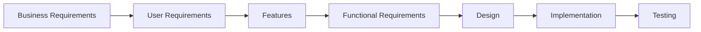

# Chapter 1 — Foundations (Exam-Ready)

## Key stats + recurring problems (very exam-friendly)
- ~**40–50%** of defects originate in the **requirements** phase.
- Common problems: informal gathering, implied functionality, miscommunicated assumptions, poor specs, casual change process.

## 1) What is a “requirement”?
A requirement is a **capability**, **condition**, or **quality** needed by a stakeholder and that the system must satisfy.

### Requirement levels (memorize)
| Level | Also called | Example (Online Shopping) |
|---|---|---|
| **Business** | Business goals | “Increase online sales by 20% in 6 months.” |
| **User** | User needs | “As a customer, I want to track my shipment.” |
| **System** | Functional + non-functional | “System shall show tracking status within 2 seconds.” |

**Mnemonic:** **B-U-S** = **B**usiness, **U**ser, **S**ystem.

## 1.1) Seven types of requirements (you must memorize)
| Type | Keyword | Example |
|---|---|---|
| Business requirements | **WHY** | “Reduce airport staff costs by 25%.” |
| System requirements | system-of-systems | “POS workstation includes scanner + printer + software.” |
| User requirements | user goals/tasks | “As a passenger, I want to check in.” |
| Business rules | policies/algorithms | “Refund only within 7 days.” |
| Functional requirements | **shall** behaviors | “System shall allow users to print boarding passes.” |
| Features | grouped capability | “Spelling checker” / “Bookmarks” |
| Non-functional requirements | **-ilities** | “Checkout page loads ≤ 2s for 95% requests.” |

## 2) Functional vs Non-Functional
- **Functional requirement (FR):** what the system **does** (features/behaviors).
- **Non-functional requirement (NFR):** how well / under what constraints (quality attributes, constraints).

## 2.1) Requirement writing rules (what examiners expect)
These are the "marks magnets":
1) **Use “shall”** for mandatory requirements (especially FRs). Avoid “will” and vague “should” unless you mean optional.
2) **Atomic:** one requirement per statement (avoid “and/or”).
3) **Verifiable:** include measurable acceptance criteria (time, accuracy, uptime, error rate, security events).
4) **No ambiguity:** remove words like “fast”, “easy”, “good”, “etc.”
5) **Separate policies/mandates:** business rules + compliance constraints should be stated clearly and then traced to FRs.

### Templates + examples (User vs FR vs NFR vs constraint)
| Type | Template | Example |
|---|---|---|
| User requirement | As a `<role>`, I want `<goal>` so that `<benefit>`. | “As a customer, I want to save my address so I can checkout faster.” |
| FR | The system **shall** `<behavior>` [when `<condition>`]. | “The system shall allow a logged-in user to save up to 3 shipping addresses.” |
| NFR (Performance) | The system **shall** `<metric>` `<threshold>` [under `<load>`]. | “The system shall load the cart page in ≤ 2 seconds for 95% requests under 100 concurrent users.” |
| Constraint/Compliance | The system **shall comply with** `<standard>` / **shall** `<restriction>`. | “The system shall comply with PCI-DSS for card payments.” |
| Business rule | Policy statement (drives FRs). | “Refund only within 7 days.” |

### Product vs Project requirements (often confused)
- **Product requirements:** implemented in the software (belongs in SRS/backlog).
- **Project requirements:** needed to deliver project but not software behavior (training, docs, migration, beta, legal).

### Quick examples
| Type | Good example | Why it’s good |
|---|---|---|
| FR | “System shall allow registered users to add items to a cart.” | Clear actor + action + condition |
| NFR (Performance) | “Search results shall be returned in ≤ 2s for 95% requests.” | Measurable + testable |

## 3) Characteristics of good requirements (often asked)
**Mnemonic:** **C-U-V-C** (plus T)
- **C**orrect
- **U**nambiguous
- **V**erifiable (testable)
- **C**omplete
- **T**raceable

### 7 characteristics of a *single requirement statement* (memorize)
**C C F N P U V**
1) Complete 2) Correct 3) Feasible 4) Necessary 5) Prioritized 6) Unambiguous 7) Verifiable

## 4) Common requirement problems (exam critique)
| Problem | Signal words | Fix pattern |
|---|---|---|
| Ambiguous | “good”, “fast”, “user-friendly” | add metric: time, error rate, SUS score |
| Not verifiable | “secure”, “easy” | convert to measurable acceptance criteria |
| Incomplete | missing actor/trigger/exception | add preconditions + alternate flows |
| Inconsistent | conflicting statements | identify source + reconcile in review |
| Design/implementation bias | “use Oracle DB” | move to constraint or remove unless mandated |
| Amalgamation | “validate and accept credit cards and cashier’s checks” | split into atomic requirements |

## 5) Stakeholders
- **Internal** (within organization): product owner, support, finance, ops, dev team.
- **External**: customers, payment gateway, courier/shipping partners, regulators.

## 6) SRE lifecycle (high-level)
Typical flow: **Elicit → Analyze/Model → Specify (SRS) → Validate → Manage/Trace**



```mermaid
flowchart LR
A[Elicitation] --> B[Analysis & Negotiation];
B --> C[Specification (SRS)];
C --> D[Validation];
D --> E[Management & Traceability];
E --> A;
```

## 7) Scenario mini-practice (like your exam)
**Scenario:** Online shopping system.
- Write 2 User requirements, 2 FRs, 2 NFRs.

**Model answer (concise):**
- User req: “As a registered user, I want to checkout using a preferred payment method.”
- User req: “As a registered user, I want to cancel my order before dispatch.”
- FR: “System shall allow a user to register with name, address, phone number.”
- FR: “System shall allow a registered user to place an order from items in cart.”
- NFR (Security): “All payment requests shall use TLS 1.2+ and store no CVV.”
- NFR (Availability): “Checkout service shall be available 99.5% monthly.”

## 8) What to memorize from Chapter 1
- Definitions: requirement, FR vs NFR, stakeholder.
- Quality criteria: **Correct, Unambiguous, Verifiable, Complete, Traceable**.
- Lifecycle: **Elicit → Analyze → Specify → Validate → Manage/Trace**.

## 9) Exam-style questions (solved)
### Q1 (Classification — 7 types)
Classify each statement:
1) “Reduce airport staff costs by 25%.” → **Business requirement** (WHY)
2) “As a passenger, I want to check in for a flight.” → **User requirement**
3) “System shall allow users to print boarding passes.” → **Functional requirement**
4) “Refund only within 7 days.” → **Business rule** (policy; drives requirements)
5) “Checkout page loads ≤ 2s for 95% requests.” → **NFR (performance)**
6) “Spelling checker.” → **Feature**
7) “POS workstation includes scanner + printer + software.” → **System requirement**

### Q2 (Product vs Project requirements)
Classify:
- “System shall encrypt passwords using salted hashing.” → **Product requirement** (software behavior/quality)
- “Create user training manual and conduct 2 training sessions.” → **Project requirement** (delivery activity)
