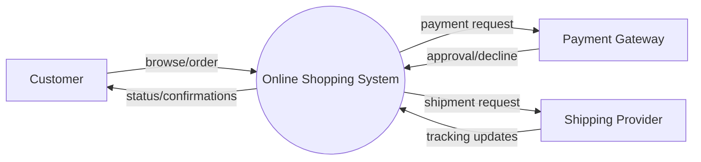
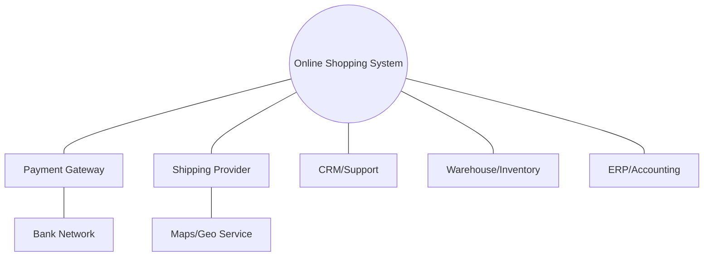
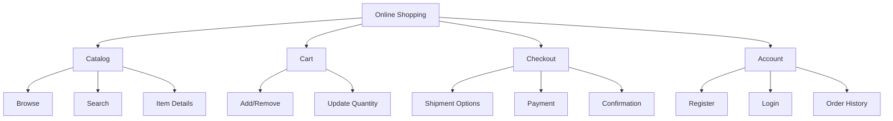
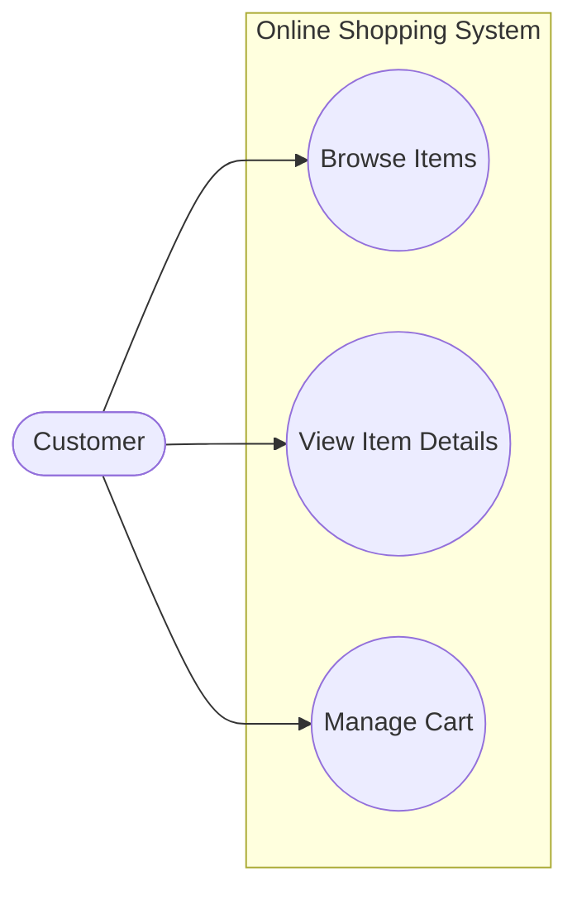

# Chapters 3–5 — Models, SRS, and Analysis Artifacts (Exam-Ready)

## 1) Why models?
Models reduce ambiguity and help stakeholders confirm understanding.

## 1.1) Scope representation (common theory)
### A) Context diagram (system boundary)

### B) Ecosystem map (shows related systems, even indirect)

### C) Feature tree (scope at a glance)

### D) Event list (name events; responses go into FRs)
| Event type | Event example |
|---|---|
| User-triggered | “User clicks Checkout” |
| Time-triggered | “Daily 2AM inventory sync” |
| Signal event | “Payment gateway sends callback” |

## 2) Use case modeling
### Use case basics
- **Actor:** external role interacting with the system.
- **Use Case:** goal-oriented interaction providing value.

### Include vs Extend (very exam common)
| Relationship | Meaning | When to use | Example |
|---|---|---|---|
| `<<include>>` | Mandatory sub-flow reused | shared steps always happen | “Checkout” includes “Calculate Total” |
| `<<extend>>` | Optional/conditional behavior | happens sometimes | “Apply Coupon” extends “Checkout” |

**Mnemonic:** **IN**clude = **IN**evitable, **EX**tend = **EX**tra/exception.

### Mermaid use-case template

## 3) Use case description (write 1 perfectly)
**Minimum fields to score well:** Name, Primary Actor, Preconditions, Postconditions, Trigger, Main Flow, Alternate/Exception Flows.

### Example (short and correct)
**Use Case:** Checkout
- Actor: Registered User
- Pre: User logged in; cart not empty
- Post: Order created; payment recorded; shipment method stored
- Main flow:
  1. User selects Checkout
  2. System shows order summary and shipment methods
  3. User selects shipment method
  4. System computes total (items + shipping)
  5. User selects payment option and confirms
  6. System processes payment and creates order
- Alternate:
  - A1 Payment fails → system shows reason; order not confirmed

## 4) Decision tables and decision trees (asked a lot)
### Difference
| Artifact | Best for | Strength |
|---|---|---|
| Decision table | many conditions/combinations | complete coverage, easier testing |
| Decision tree | sequential decisions | visual logic flow |

### Decision table mini-example (Shipping fee)
Conditions:
- C1: Order total ≥ 5000?
- C2: City = Lahore?

Actions:
- A1: Shipping fee = 0
- A2: Shipping fee = 200
- A3: Shipping fee = 350

| Rule | C1 | C2 | Action |
|---|---|---|---|
| R1 | Y | Y | A1 |
| R2 | Y | N | A2 |
| R3 | N | Y | A2 |
| R4 | N | N | A3 |

## 5) SRS structure (what exam expects)
Common IEEE-style sections (keep concise):
1. Introduction
2. Overall Description
3. Specific Requirements
4. Appendices

### “Constraints” section (your exam asks)
Constraints are **mandatory limitations** imposed on design/implementation/operations, e.g.
- Regulatory (PCI-DSS for payments)
- Platform (must run on university servers)
- Technology mandated by client

## 6) Separating functionality from implementation (exam question)
- Write **what** the system shall do, not **how** to implement.
- Benefits:
  - avoids premature design decisions
  - keeps options open
  - improves stakeholder readability
  - reduces rework when tech changes

**Bad (implementation):** “System shall use React and MongoDB.”
**Good (functional/constraint):** “System shall provide a web UI compatible with latest Chrome/Edge.”

## 7) Quick exam practice prompts
- Write 5 atomic FRs from a scenario.
- Draw use-case diagram with at least one include and one extend.
- Convert an ambiguous requirement into testable form.

## 8) Exam-style questions (solved)
### Q1 (Event list + responses)
For Online Shopping, write **3 events** (one of each type) and the expected response.

| Event type | Event | System response (FR-style summary) |
|---|---|---|
| User-triggered | User clicks “Add to cart” | Add selected item/qty to cart and show updated cart count |
| Time-triggered | Midnight inventory sync | Refresh item availability and mark out-of-stock items |
| Signal event | Payment gateway callback received | Update payment status and confirm/decline order |

### Q2 (Decision table — cancel order)
Conditions:
- C1: Order dispatched?
- C2: Payment captured?

Actions:
- A1: Allow cancel + refund
- A2: Allow cancel + no refund (if not paid)
- A3: Do not allow cancel; suggest return process

| Rule | C1 dispatched | C2 paid | Action |
|---|---|---|---|
| R1 | N | Y | A1 |
| R2 | N | N | A2 |
| R3 | Y | Y | A3 |
| R4 | Y | N | A3 |

### Q3 (Include vs Extend — pick correctly)
- “Checkout” **includes** “Calculate Total” because it always happens.
- “Apply Coupon” **extends** “Checkout” because it happens only if user enters a valid coupon.
