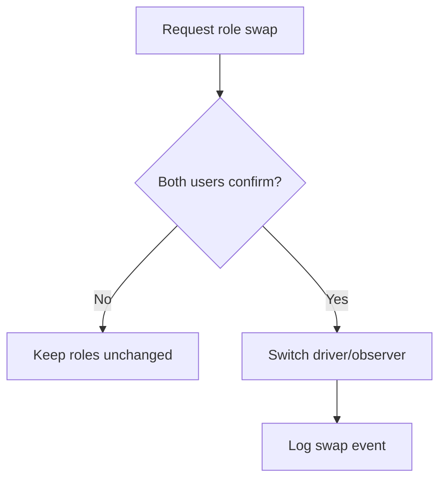

# Requirement Analysis & Negotiation (Exam-Ready)

## 1) What is requirement analysis?
Transform raw needs into **clear, consistent, prioritized, feasible** requirements.

### Typical phases
1. **Understand** (context + domain)
2. **Model** (use cases, data, rules)
3. **Decompose** (split into atomic requirements)
4. **Prioritize** (value, cost, risk)
5. **Negotiate** (resolve conflicts)
6. **Specify** (SRS / backlog)

## 2) Analysis vs Negotiation (asked)
| Analysis | Negotiation |
|---|---|
| clarify, model, detect issues | resolve conflicts, trade-offs |
| focus on correctness/consistency | focus on agreement among stakeholders |
| outputs: models, refined reqs | outputs: decisions, priorities, baselines |

## 2.1) Three analysis checking activities (memorize)
1) **Necessity**: does it contribute to goals?
2) **Consistency & completeness**: conflicts or missing pieces?
3) **Feasibility**: doable within time/budget/tech?

## 2.2) Negotiation stages (asked)
1) Discussion → 2) Prioritization → 3) Agreement

Meeting stages (good exam phrasing): Information → Discussion → Resolution

## 3) Common analysis artifacts
- Use cases + descriptions
- Data dictionary
- Business rules
- Decision tables/trees
- State models (if needed)

## 3.1) Visual models (name 10 quickly)
DFD, process/swimlane, state-transition, dialog map, decision table/tree, event-response table, feature tree, use case, activity diagram, ERD.

## 4) Prioritization (value/cost/risk)
A common exam-friendly approach:
- Compute **Total Value** from benefits and penalties (weighted by stakeholders)
- Convert to **Value%**
- Convert **Cost%** and **Risk%**
- Compute **Priority score** (assumption-based):
  - Option A (simple): `Priority = Value% - (Cost% + Risk%)/2`
  - Option B (Wiegers-style): `Priority = (Value%)/(Cost% + Risk%)`

In past papers, always **state your chosen formula as an assumption**.

## 5) Example: decision tree (role swap in remote pair programming)

## 6) Making requirements atomic (important)
**Bad (amalgamated):** “Validate and accept credit cards and cashier’s checks.”
**Good (split):**
- FR-1: “System shall validate credit card details.”
- FR-2: “System shall accept payment via credit card.”
- FR-3: “System shall accept payment via cashier’s check.”

## 6.1) Three common requirement error types
- **Omission** (missing implicit knowledge)
- **Clarity/Ambiguity** (natural language vagueness)
- **Speed/Capacity** (performance misunderstood)

## 7) Mini practice prompt
Given “System must have good usability”, rewrite as testable:
- “New users shall complete checkout in ≤ 3 minutes in usability test (n=10), with ≤ 1 critical error.”

## 8) Exam-style questions (solved)
### Q1 (Necessity check)
Requirement: “System shall provide animated fireworks on successful payment.”
- Necessity result: **Likely unnecessary** (doesn’t contribute to business goal); classify as gold plating unless explicitly requested.

### Q2 (Mini prioritization — state assumptions)
Assume priority score = Value/(Cost+Risk). Two requirements:

| Req | Value | Cost | Risk | Priority |
|---|---:|---:|---:|---:|
| R1 “Order tracking” | 8 | 3 | 2 | 8/(3+2)=**1.60** |
| R2 “Dark mode” | 5 | 2 | 1 | 5/(2+1)=**1.67** |

Interpretation: R2 slightly higher by this formula; if tracking is strategic goal, negotiation may override purely numeric priority.

### Q3 (Requirements interaction matrix — tiny)
Fill: conflict=1, overlap=1000, independent=0.

|  | R1 Order tracking | R2 Email notifications |
|---|---:|---:|
| R1 Order tracking | — | 1000 (overlap) |
| R2 Email notifications | 1000 (overlap) | — |
