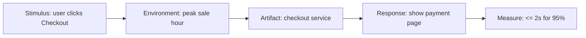

# Non-Functional Requirements (NFRs) — Exam-Ready

## 1) What are NFRs?
NFRs specify **quality attributes** and **constraints** that shape system behavior.

## 2) Common NFR categories (memorize)
**Mnemonic:** **P-S-U-R-A-M**
- **P**erformance
- **S**ecurity
- **U**sability
- **R**eliability/Availability
- **A**uditability/Compliance
- **M**aintainability

## 3) How to write good NFRs
### Template
- Metric + threshold + scope

Examples:
- Performance: “Search shall return results in ≤ 2s for 95% of requests under 100 concurrent users.”
- Availability: “Checkout shall be available 99.5% per month.”
- Security: “All passwords shall be stored using salted hashing (e.g., bcrypt/Argon2).”
- Usability: “SUS score ≥ 75 in usability study of 12 users.”

## 4) Challenges for NFRs (asked)
| Challenge | Why it happens | Fix |
|---|---|---|
| Vague terms | “good”, “fast”, “secure” | define measurable metric |
| Cross-cutting | affects many modules | NFRs as system-wide constraints + trace links |
| Trade-offs | security vs usability vs performance | negotiation + priorities |
| Hard to test early | needs real load/users | staged tests + prototypes + acceptance criteria |

## 5) NFRs vs constraints
- **NFR:** quality attribute target.
- **Constraint:** mandated technology/standard/limit.

Example constraint: “Must comply with PCI-DSS.”
Example NFR: “No CVV stored after authorization.”

## 6) NFR diagram: quality attribute scenario

## 7) Mini practice (FastKart)
Pick 2 critical NFRs for first increment:
- Performance (browse + order)
- Security (payment + PII)

Model answer:
- “Payment API calls shall use TLS 1.2+.”
- “Browse pages shall load in ≤ 2s for 90% of users on 4G network.”

## 8) Exam-style questions (solved)
### Q1 (Fix vague NFRs)
Rewrite each into verifiable form:
1) “System must be secure.” → “All authenticated endpoints shall require a valid session token; failed logins shall lock account after 5 attempts for 15 minutes.”
2) “System must be fast.” → “Search shall return results in ≤ 2 seconds for 95% requests under 100 concurrent users.”
3) “System must have good usability.” → “SUS score ≥ 75 in usability study of 12 users.”

### Q2 (Pick 2 critical NFRs for Increment 1 — Online Shopping)
- Security: “All payment requests shall use TLS 1.2+; CVV shall not be stored.”
- Availability: “Checkout shall have 99.5% monthly uptime.”
