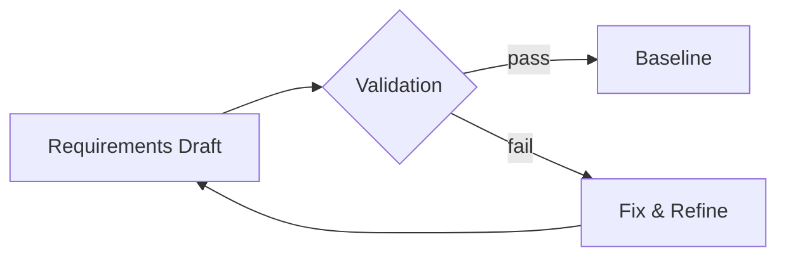

# Requirement Validation (Exam-Ready)

## 1) Why validation matters (asked)
Validation ensures requirements are:
- correct, complete, consistent
- feasible within constraints
- aligned with business goals
- testable/traceable

**Mnemonic:** **C-C-C-F-A-T**
Correct, Complete, Consistent, Feasible, Aligned, Testable.

## 1.1) Analysis vs Validation (quick)
- **Analysis:** works with raw elicited requirements; finds gaps/conflicts and refines.
- **Validation:** checks the final draft is an acceptable description and can be accepted/tested.

## 2) Validation techniques
| Technique | What it checks | Notes |
|---|---|---|
| Reviews/Inspections | clarity, consistency, missing cases | most common exam answer |
| Prototyping | usability/flow correctness | good for UI systems |
| Test-case derivation | verifiability | if you can’t test it, rewrite it |
| Walkthroughs | stakeholder understanding | scenario-based |

## 2.1) V-Model mapping (easy marks)
| Development | Corresponding test |
|---|---|
| User requirements | Acceptance testing |
| Functional requirements | System testing |
| System architecture | Integration testing |
| Module design | Unit testing |

## 3) Formal review process (asked)
Typical steps:
1. Plan review (scope, participants)
2. Distribute SRS/materials
3. Individual preparation
4. Review meeting (log defects)
5. Rework (fix defects)
6. Follow-up (verify fixes)

## 4) Checklist for validating a requirement statement
- Actor identified?
- Trigger/condition clear?
- Single behavior (atomic)?
- No ambiguous words?
- Measurable acceptance criteria?

## 5) Example: critique and fix
**Bad:** “The system must have good usability.”
**Fix:** “In usability test (n=10), users shall complete checkout with ≤ 1 critical error and average completion time ≤ 3 minutes.”

## 6) Diagram: validation as gate

## 7) Exam-style questions (solved)
### Q1 (Formal inspection roles)
Name 5 roles:
- Author
- Moderator
- Reader
- Recorder
- Inspectors

### Q2 (Apply validation checklist)
Requirement: “Professor logs in by providing username, password, and other relevant information.”

Checklist result:
- Actor? **Yes** (Professor)
- Trigger/condition? **Missing** (when/where login happens)
- Atomic? **No** (mixes required fields + vague extras)
- Ambiguity? **Yes** (“other relevant information”)
- Verifiable? **No** (can’t test unknown fields)

Improved requirement:
“Professor shall log in by providing username and password; if multi-factor authentication is enabled, the professor shall also provide a one-time code sent via email/SMS.”
