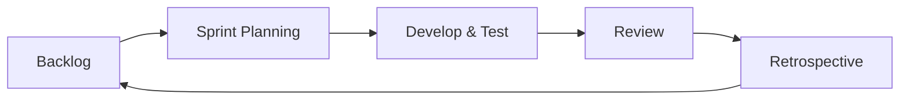

# Agile Methodologies & Requirements Engineering (Exam-Ready)

## 1) How Agile RE differs from “classical”
| Classical / Plan-driven | Agile |
|---|---|
| heavy upfront SRS | evolving backlog |
| change is controlled & costly | change is expected |
| complete requirements early | just-enough requirements per sprint |
| sign-off heavy | continuous stakeholder feedback |

## 2) Agile requirement artifacts
- **Epics → User Stories → Tasks**
- Acceptance criteria (Given/When/Then)

### User story template
“As a <role>, I want <goal>, so that <benefit>.”

### Acceptance criteria example
**Story:** As a customer, I want to track my order so I can plan delivery.
- Given I have an active order
- When I open tracking
- Then I see current status and ETA

## 3) Prioritization in Agile
- MoSCoW: Must/Should/Could/Won’t
- WSJF (optional): Cost of Delay / Job Size

**Mnemonic:** **MoSCoW** is itself the mnemonic.

## 4) Definition of Ready vs Done
- DoR: story has clear scope/AC/dependencies
- DoD: implemented, tested, accepted

## 5) Exam-style scenario prompt (like your papers)
“For FastKart, propose first increment requirements.”
Answer style:
- deliver minimal valuable slice: browse → cart → checkout → order confirmation
- include critical NFRs: security + performance

## 6) Diagram: Agile feedback loop

## 7) Exam-style questions (solved)
### Q1 (Convert feature → user stories)
Feature: “Real-time order tracking”

User story:
“As a customer, I want to track my active order, so that I can know where it is and the ETA.”

Acceptance criteria (Given/When/Then):
- Given I have an active order, when I open tracking, then I see current status and ETA.
- Given tracking service is unavailable, when I open tracking, then I see last known status and a retry option.
- Given I cancel the order, when I open tracking, then status shows “Canceled” and no ETA.

### Q2 (First sprint slice — FastKart)
Sprint 1 (Must-have slice): Browse → Cart → Checkout → Order confirmation.
Add NFRs as acceptance constraints: TLS for payment; page load target for catalog.
