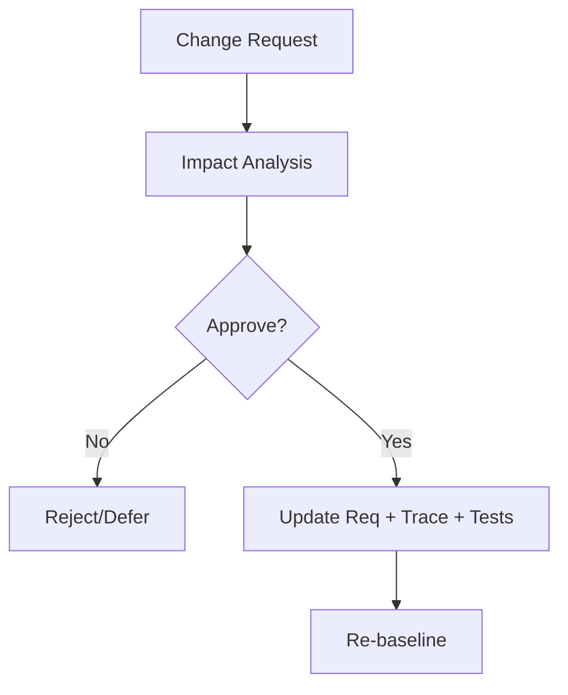

# Requirements Management (Exam-Ready)

## 1) What is requirements management?
Plan, control, and track requirements throughout change.

## 2) How RM deals with changes (asked)
Core steps:
1. **Baseline** requirements (agreed version)
2. **Change request (CR)** submitted
3. **Impact analysis** (scope, cost, schedule, risk, dependencies)
4. **Decision** (approve/reject/defer)
5. **Update artifacts** (SRS/backlog, trace matrix, tests)
6. **Communicate** to stakeholders

**Mnemonic:** **B-C-I-D-U-C**
Baseline, Change request, Impact, Decision, Update, Communicate.

## 2.1) Baseline definition (exam wording)
A **baseline** is an approved snapshot of requirements committed for a specific release; changes happen only via change control.

## 2.2) Change Control Board (CCB)
CCB decides whether changes are accepted, rejected, or deferred.

Typical representation (acceptable in exams):
- PM/Program manager
- BA/Product owner
- Dev lead
- QA/Test lead
- Customer/stakeholder representative
- Support/ops representative

## 3.1) Requirement attributes (often asked)
Common “must store” attributes (10): date created, version, author, priority, status, source, rationale, target release, stakeholder contact, acceptance criteria.

## 6.1) Stable vs volatile requirements
- Stable: core domain essence.
- Volatile: depend on environment/customer and change often.

Volatile types (name-only is enough): mutable, emergent, consequential, compatibility.

## 3) Versioning and baselines
- Baseline = reference set for a release.
- Every approved change increments version.

## 4) Prioritization + release planning
Common criteria table:
| Factor | Meaning |
|---|---|
| Value | benefit - penalty |
| Cost | effort/resources |
| Risk | uncertainty/complexity |

## 5) Requirement attributes (store in tool/spreadsheet)
- ID, title, description
- type (FR/NFR), priority, status
- source, rationale
- acceptance criteria
- trace links (design, code, test)

## 6) Mini example: change request
**CR:** Add “guest checkout”.
Impact:
- FRs: new flows, fraud risk
- NFRs: security, privacy
Decision: maybe defer to increment 2

## 7) Diagram: Change control

## 8) Exam-style questions (solved)
### Q1 (Impact analysis — Guest checkout)
**CR:** Allow guest checkout (no account required).

Impact (quick table):
| Area | Impact |
|---|---|
| Requirements | Add guest flow; update registration/login constraints |
| NFRs | higher fraud risk → stronger payment checks; privacy notices |
| UI/UX | new screens for email/phone capture during checkout |
| Testing | new test cases for guest order, cancellation, receipts |
| Traceability | update RTM links for modified checkout requirements |

Decision example: Approve for Increment 2 if risk high; keep Increment 1 registered-only.

### Q2 (Change metrics — name 3)
- Total change requests received/open/closed
- Count of added/modified/deleted requirements since baseline
- Change origin analysis (which stakeholder/source generates most changes)
