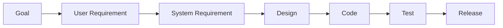

# Requirements Traceability (Exam-Ready)

## 1) What is traceability?
Ability to **follow a requirement** from origin → specification → design/code → tests → release.

## 2) Why it’s important (asked)
- impact analysis for change
- ensures coverage (no missing implementation/testing)
- compliance/audit evidence
- reduces scope creep

## 3) Types of traceability (asked)
| Type | Direction | Example |
|---|---|---|
| Forward traceability | req → design/code/test | FR-12 → module CartService → Test TC-12 |
| Backward traceability | test/code → req | Test TC-12 traces back to FR-12 |
| Vertical | across abstraction levels | goal → user req → system req |
| Horizontal | within same level | req ↔ req dependencies |

**Mnemonic:** **F-B-V-H**
Forward, Backward, Vertical, Horizontal.

## 3.1) Other categorizations (name-only)
- Pre-RS vs Post-RS traceability
- Inter-requirements vs Extra-requirements traceability

## 4) Traceability matrix (RTM)
Example skeleton:
| Req ID | Use case | Design | Code | Test cases | Status |
|---|---|---|---|---|---|
| FR-01 | UC-Register | ARCH-01 | auth/* | TC-01..TC-03 | Done |

## 4.1) Traceability analyses (asked)
- **Impact analysis:** what breaks if this changes? (forward)
- **Derivation analysis:** where did this come from? (backward)
- **Coverage analysis:** is everything implemented/tested? (end-to-end)

## 5) Tool support (asked)
Tools help with:
- version control of requirements
- linking artifacts (req ↔ test ↔ code)
- change impact reports
- coverage dashboards

Even a spreadsheet can be acceptable in exams, but mention professional tools exist.

## 6) Diagram: trace chain

## 7) Exam-style questions (solved)
### Q1 (Mini RTM — Online Shopping)
| Req ID | Source | Use case | Test case | Trace type |
|---|---|---|---|---|
| FR-01 Register user | Customer + business goal | UC-Register | TC-REG-01 | forward + backward |
| FR-02 Add to cart | Customer | UC-ManageCart | TC-CART-03 | forward |
| NFR-01 Checkout response time | Sponsor | UC-Checkout | TC-PERF-01 | forward |

### Q2 (Name 3 analyses)
- Impact analysis
- Derivation analysis
- Coverage analysis
