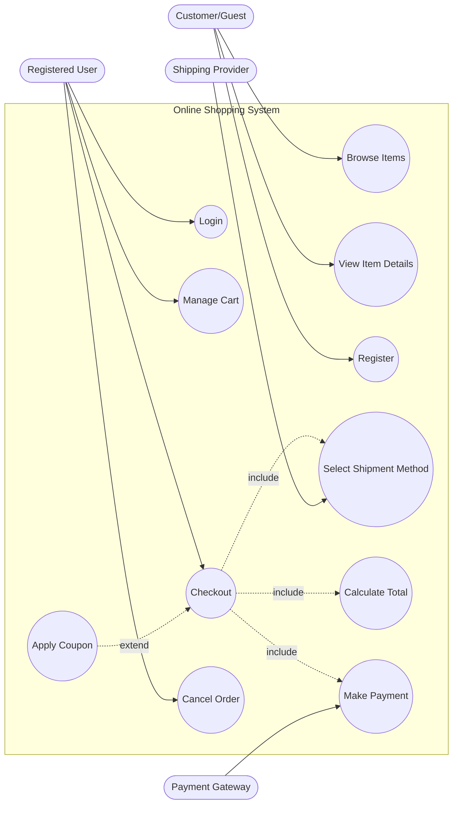
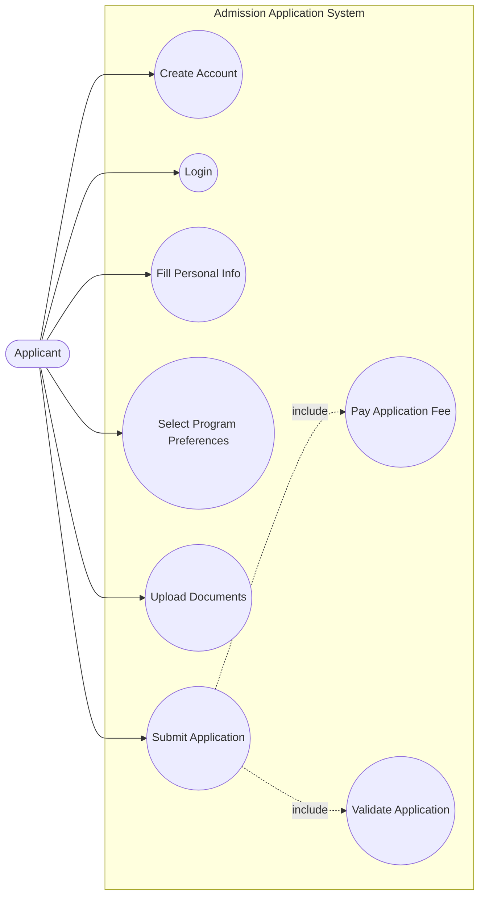
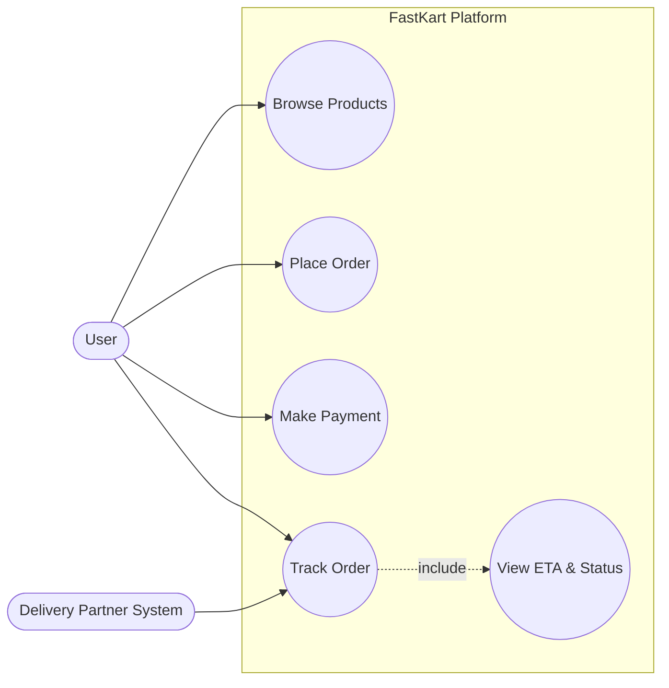
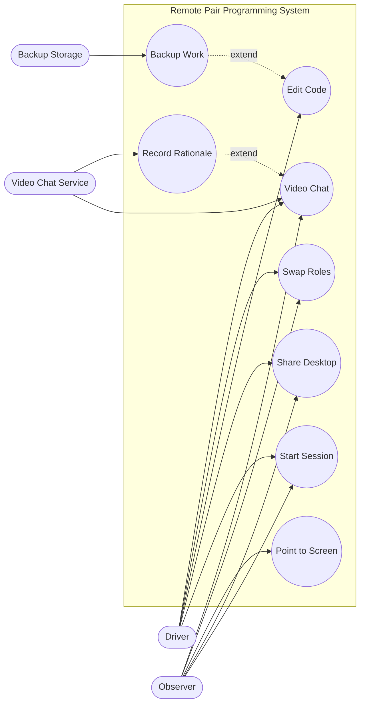
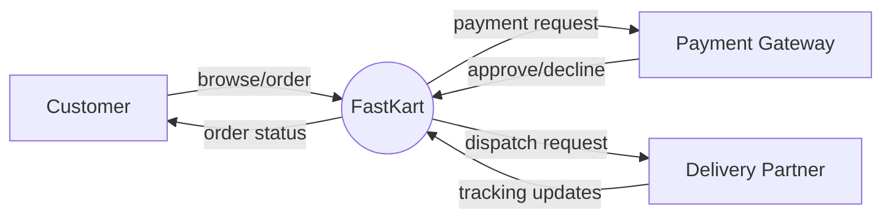
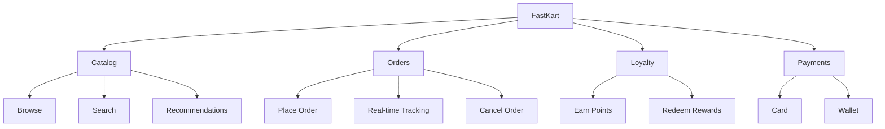

# Solved Past Papers (From Your Syllabus) + Extra Exam-Style Questions

> Important: Some tables in the pasted paper text are partially formatted. Where needed, I state **clear assumptions** and then solve using a standard prioritization method.

---

## Paper Set A — Online Shopping System

### Question 1 (Marks 10)
**Case:** Online shopping system (browse, view details, cart, register, order, cancel, checkout, payment + shipment).

#### A) Identify stakeholders (2 internal + 2 external) (Marks 2+2)
**Internal stakeholders (any 2):**
- Product Owner / Business Owner
- Customer Support team
- Operations/Warehouse manager
- Finance/Accounts

**External stakeholders (any 2):**
- Customers (registered users)
- Payment gateway/bank
- Courier/shipping partner
- Regulatory bodies (data/privacy, payments)

#### B) Use case model with at least one `<<include>>` and one `<<extend>>` (Marks 6)
Actors:
- Customer (Guest)
- Registered User
- Payment Gateway (external system)
- Shipping Provider (external system)

Notes (what examiner looks for):
- `<<include>>` is **mandatory** subflow during Checkout.
- `<<extend>>` is **optional** behavior (coupon only if user has one).

---

### Question 2 (Marks 10)
**Incremental SDLC:** deliver subset in first increment.

#### 8 FRs for first increment (Marks 8)
Properties targeted: **complete, verifiable, unambiguous**.

1. **FR-01 (Browse):** System shall display a list of available items with name, price, and availability status.
2. **FR-02 (View details):** System shall display item details (description, price, stock status) when a user selects an item.
3. **FR-03 (Register):** System shall allow a user to register by providing name, address, and phone number.
4. **FR-04 (Login):** System shall allow a registered user to log in using a unique identifier (e.g., email/username) and password.
5. **FR-05 (Add to cart):** System shall allow a logged-in user to add an item to the shopping cart with a specified quantity.
6. **FR-06 (Remove from cart):** System shall allow a logged-in user to remove an item from the shopping cart.
7. **FR-07 (Checkout summary):** System shall show an order summary (items, quantities, item subtotal, shipping charge, total) before payment.
8. **FR-08 (Place order):** System shall create an order when payment is successful and provide an order confirmation number.

#### 2 critical NFRs for first increment (Marks 2)
1. **Security:** All authentication and payment-related communications shall use TLS 1.2+.
2. **Performance:** Browse and item-detail pages shall load in ≤ 2 seconds for 90% of requests under 100 concurrent users.

---

### Question 3 (Marks 10)
**Eliciting requirements for 20-week project.**

#### A) Two suitable techniques (2+2)
1) **Interviews**
2) **Prototyping**

#### B) Benefit + limitation of each (3+3)
**Interviews**
- Benefit: deep understanding; enables immediate clarification.
- Limitation: time-consuming; bias; inconsistent answers if not structured.

**Prototyping**
- Benefit: reduces ambiguity of UI flows (cart/checkout); early validation.
- Limitation: stakeholders may assume prototype = final product; rework if scope changes.

---

### Question 4 (Marks 7) — Prioritization calculation
The table in the pasted paper is partially formatted; I’ll solve using a **standard weighted benefit/penalty method**.

#### Assumptions (state in exam)
- Two stakeholders with weights: **W1 = 0.5**, **W2 = 1.0**.
- For each requirement:
  - TotalBenefit = W1*Benefit1 + W2*Benefit2
  - TotalPenalty = W1*Penalty1 + W2*Penalty2
  - TotalValue = TotalBenefit − TotalPenalty
  - Value% = TotalValue / ΣTotalValue * 100
  - Cost% = Cost / ΣCost * 100
  - Risk% = Risk / ΣRisk * 100
  - Priority score = Value% / (Cost% + Risk%)  (common exam-friendly ratio)

#### Given values (from your text)
- FR-01: Benefit1=7, Penalty1=3, Benefit2=5, Penalty2=3, Cost=2, Risk=2
- FR-02: Benefit1=3, Penalty1=7, Benefit2=9, Penalty2=7, Cost=3, Risk=5

#### Step 1 — Total Benefit / Penalty / Value
- FR-01:
  - TotalBenefit = 0.5*7 + 1.0*5 = 3.5 + 5 = **8.5**
  - TotalPenalty = 0.5*3 + 1.0*3 = 1.5 + 3 = **4.5**
  - TotalValue = 8.5 − 4.5 = **4.0**
- FR-02:
  - TotalBenefit = 0.5*3 + 1.0*9 = 1.5 + 9 = **10.5**
  - TotalPenalty = 0.5*7 + 1.0*7 = 3.5 + 7 = **10.5**
  - TotalValue = 10.5 − 10.5 = **0.0**

ΣTotalValue = 4.0 + 0.0 = 4.0
ΣCost = 2 + 3 = 5
ΣRisk = 2 + 5 = 7

#### Step 2 — Percentages
- FR-01:
  - Value% = 4.0/4.0*100 = **100%**
  - Cost% = 2/5*100 = **40%**
  - Risk% = 2/7*100 ≈ **28.57%**
  - Priority = 100 / (40 + 28.57) ≈ **1.458**

- FR-02:
  - Value% = 0/4*100 = **0%**
  - Cost% = 3/5*100 = **60%**
  - Risk% = 5/7*100 ≈ **71.43%**
  - Priority = 0 / (60 + 71.43) = **0**

#### Final table
| Req | Total Benefit | Total Penalty | Total Value | Value% | Cost% | Risk% | Priority |
|---|---:|---:|---:|---:|---:|---:|---:|
| FR-01 | 8.5 | 4.5 | 4.0 | 100.00 | 40.00 | 28.57 | 1.458 |
| FR-02 | 10.5 | 10.5 | 0.0 | 0.00 | 60.00 | 71.43 | 0.000 |

Interpretation: FR-01 should be prioritized first.

---

### Question 5 (Marks 13) — SRS qualities + constraints + separation
#### A) 5 key characteristics of a good SRS (5 marks)
1. Correct
2. Unambiguous
3. Complete
4. Verifiable
5. Traceable

#### B) Define “Constraints” section (3 marks)
Constraints are **mandatory restrictions** on system design/implementation/operation (technology, standards, legal/regulatory, hardware/OS, interfaces).

#### C) Separating functionality from implementation (5 marks)
- Prevents premature design decisions
- Makes requirements readable for stakeholders
- Keeps vendor/technology choices flexible
- Reduces rework when technology changes
- Supports objective verification (tests based on behavior, not code)

---

## Paper Set B — Theory (Management + Traceability)

### Q1 (CLO1) (10)
**How RM deals with changes + traceability importance + types + tool support.**

**Change handling (RM):** baseline → CR → impact analysis → approve/reject → update artifacts → communicate → re-baseline.

**Importance of traceability:** impact analysis, coverage, compliance, reduces scope creep.

**Types:** Forward, Backward, Vertical, Horizontal.

**Tool support:** link requirements to design/code/tests; auto impact reports; versioning; dashboards.

---

### Q2 (CLO1,5) (10)
**Why validation important + steps in formal review + SRS characteristics.**

- Validation prevents building wrong product; removes ambiguity early.
- Formal review steps: plan, distribute, prep, meeting/log defects, rework, follow-up.
- SRS characteristics: correct, complete, consistent, unambiguous, verifiable, traceable, modifiable.

---

### Q3 (CLO2) (10)
**Elicitation techniques + alumni management system technique choice.**

List techniques: interviews, workshops, observation, surveys, docs, prototyping.

Recommended for alumni system:
- Workshops (align admin + students + alumni office)
- Interviews (deep dive for complex policies)
Optionally surveys for alumni preferences.

---

### Q4 (CLO3) (10)
**Difference between analysis and negotiation + COMSATS admission use case diagram.**

Difference: see `04_requirement_analysis_and_negotiation.md`.

Use case diagram (simplified):

---

### Q5a (CLO4)
**Criticize requirements (identify problems).**

I) “Store user info including name, DOB, address and SSN.”
- Problem: privacy/scope; SSN may be unnecessary; missing security constraints; incomplete consent/retention.

II) “Switch between displaying and hiding non-printing characters instantaneously.”
- Problem: “instantaneously” ambiguous; define response time.

III) “Must have good usability.”
- Problem: ambiguous and not verifiable; define metric.

IV) “Students will be able to enroll to undergraduate and post graduate courses.”
- Problem: ambiguous actor (which students?); missing conditions (prereqs), missing verifiable details.

V) “Professor logs in by providing username, password, and other relevant information.”
- Problem: “other relevant information” ambiguous; define exactly what else (OTP?) or remove.

---

## Paper Set C — FastKart Case Study

### Q1 (10)
Identify 1 user req, 2 FRs, 2 NFRs + reasoning.

**User requirement (1):**
- UR-1: “As a user, I want personalized recommendations so I can find products faster.”
  - Reason: directly supports goal #1 (engagement).

**Functional requirements (2):**
- FR-1: “System shall display a personalized ‘Recommended for you’ section based on purchase and browsing history.”
  - Why FR: system behavior/feature.
- FR-2: “System shall show real-time order tracking status (placed, packed, out-for-delivery, delivered) for active orders.”
  - Why FR: observable feature.

**Non-functional requirements (2):**
- NFR-1 (Performance): “Tracking status updates shall appear within 5 seconds of backend status change for 95% events.”
  - Why NFR: quality/performance constraint.
- NFR-2 (Security/Privacy): “User profile and purchase history shall be accessible only to the authenticated user; access shall be logged.”
  - Why NFR: quality/security constraint.

### Q2 (7)
Two effective elicitation techniques + justification.
- **Analytics + interviews** (or interviews + workshops):
  - Interviews with frequent shoppers + delivery staff: uncover needs/pain points.
  - Workshops with management/marketing/engineering: align goals, define recommendation rules + loyalty policies.

### Q3 (8)
Use case diagram + write one use case (real-time tracking).

**Use Case: Track Order**
- Actor: User
- Pre-condition: User logged in; user has an active order
- Post-condition: Latest tracking status is displayed
- Normal flow:
  1. User opens “My Orders”
  2. User selects an order
  3. System requests latest status from tracking service
  4. System displays current status + ETA
- Alternate flow:
  - A1 Tracking service unavailable → show last known status + “refresh later”

---

## Paper Set D — Remote Pair Programming Case

### Q4 (7)
#### i) Identify actors + use cases
Actors:
- Driver
- Observer
- Video Chat Service (external)
- Backup Storage (external)

Use cases:
- Start session
- Share desktop
- Driver edits code
- Observer points/highlights
- Swap roles
- Video chat
- Record rationale (video)
- Backup old work

#### ii) Use case diagram

#### iii) One complete use case description (example: Swap Roles)
**Use Case:** Swap Roles
- Actors: Driver, Observer
- Pre: Session active; both connected
- Post: Driver/Observer permissions exchanged; event logged
- Normal flow:
  1. Driver clicks “Request role swap”
  2. System prompts Observer to confirm
  3. Observer confirms
  4. System swaps permissions (edit vs point)
  5. System logs swap event
- Alternate:
  - A1 Observer rejects → no changes; notify Driver

---

## Extra Exam-Style Questions (Very Similar Pattern)
1) Given a “Library Management System” scenario, identify 2 internal + 2 external stakeholders and draw a use-case diagram with include/extend.
2) Rewrite 5 ambiguous requirements into verifiable ones.
3) For an incremental release, propose 6 FRs + 2 NFRs for the first increment and justify prioritization.

---

## Extra Solved Questions (By Topic — diagram heavy)

### Chapter 1 (Types + hierarchy) — Solved
Classify:
- “Must comply with PCI-DSS.” → **Constraint / compliance requirement** (often treated under NFR/compliance)
- “As a user, I want to view shipment details.” → **User requirement**
- “System shall allow cancel order before dispatch.” → **Functional requirement**

Hierarchy (one line): Business → User → Feature → Functional → Design → Code → Test.

### Chapters 3–5 (Scope techniques) — Solved
#### A) Context diagram (FastKart)

#### B) Feature tree (FastKart)

#### C) Event list (FastKart)
| Event type | Event | Expected response |
|---|---|---|
| User-triggered | User taps “Track Order” | Show latest status + ETA |
| Time-triggered | Weekly rewards expiration job | Expire points and notify user |
| Signal | Delivery partner sends status update | Update tracking timeline |

### Elicitation — Solved
You need requirements for loyalty + recommendations:
- Techniques: **Interviews** + **Workshops**
- Why: interviews uncover motivations; workshops define policies and resolve conflicts (marketing vs ops).

### Analysis (Decision table) — Solved
Policy: Cancel allowed only before dispatch; refund depends on payment.

| Rule | Dispatched? | Paid? | Result |
|---|---|---|---|
| R1 | No | Yes | Cancel + refund |
| R2 | No | No | Cancel (no refund) |
| R3 | Yes | Yes | No cancel → return process |
| R4 | Yes | No | No cancel → return process |

### Non-functional requirements — Solved
Write 2 testable NFRs for tracking:
- “Tracking updates shall appear within 5 seconds for 95% status changes.”
- “Tracking endpoint shall be available 99.5% monthly.”

### Validation — Solved
Formal review steps: Plan → Distribute → Prep → Meeting/log defects → Rework → Follow-up.

### Agile — Solved
Convert “real-time tracking” to a user story:
“As a customer, I want to track my order in real time, so I can plan delivery.”

Acceptance criteria:
- Given an active order, when I open tracking, then I see status + ETA.
- Given service is down, then I see last known status + retry.

### Management — Solved
Change request: “Guest checkout”.
- Do impact analysis (reqs + UI + NFR fraud/privacy + tests), then approve/defer and re-baseline.

### Traceability — Solved (Mini RTM)
| Req | Source | Design | Test |
|---|---|---|---|
| FR-Checkout | Sponsor/User | Checkout module | TC-CHK-01 |
| NFR-Perf | Sponsor | Caching/DB index | TC-PERF-01 |
